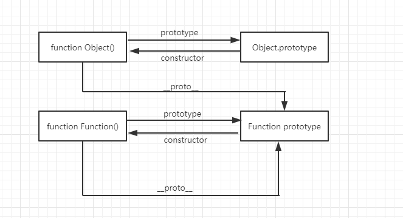

## 数据类型

1. 类型
   - 基本类型：string,  number, boolean, undefined, null
   - 对象（引用）类型：Object（任意对象）, Function（一种特别的对象，可以执行）, Array（一种特别的对象，有数值下标，内部数据是有序的）, symbol（ES6新增）

2. 类型判断

   - typeof：直接返回数据类型，是一个字符串，可以判断undefined/number/string/boolean/function,不可以判断null与 object， object与array

     ```js
     let a = 'hello'
     let b
     let c = {}
     let arr = [1, 2, 3]
     let aa = null
     console.log(typeof a)  //string
     console.log(typeof b)  // 'undefined'
     console.log(typeof b)  // object
     console.log(typeof arr)  // object
     /** 使用typeof 判断null类型返回object是一个历史遗留问题，详情请自行百度或者谷歌*/
     console.log(typeof aa)  // object
     ```

   - instanceof： 判断对象的具体类型，返回一个布尔值

     ```js
     let obj = {
         a: [1, 'hahah', true],
         b: function() {
             console.log('hello')
         }
     }
     
     console.log(obj instanceof Object, obj instanceof Array)  // true, false
     console.log(obj.a instanceof Array, obj.a instanceof Object)  // true, true
     console.log(obj.b instanceof Function, obj.b instanceof Object)  // true, true
     ```

   - ===：全等判断，可以判断undefined， null，返回布尔值

3. 思考问题
   - undefined与null的区别？undefined是已经定义了，但是未赋值。
   null是定义并且赋值了，值是null。

   - 什么时候赋值为null？当变量将要赋值为一个对象的时候，可以先将变量初始赋值为null。在结束前，将变量赋值为null，让指向的对象为垃圾对象，可以被浏览器回收。

## 数据变量内存

1. 数据： 存储在内存中代表特定信息的东西，本质上是二进制的代码（01010）

2. 内存： 内存条通电后产生的可存储数据的空间（临时的）
    
    - 内存的生命周期：内存条 -> 通电 -> 产生内存空间 -> 存储数据 -> 处理数据 -> 断电 -> 内存空间和数据消失

    - 一块小内存的2个数据： 内部存储的数据和地址值

    - 内存分类： 栈，堆 

3. 变量： 可变化的量，由变量名和变量值组成。每个变量都对应的一块小内存，变量名用来查找对应的内存，变量值就是内存中保存的数据。


4. 数据，内存，变量三者之间的关系：

    - 数据存储在内存空间里

    - 变量是内存的标识

5. 思考题

    - 定义一个变量a， a内存中保存的是什么？当a是基本数据时，保存的这个数据。当a是一个对象时，保存的是指向对象的指针地址。当a为一个变量，保存变量的内容。

    - 在js调用函数是传递变量参数时，是值传递还是引用传递？

    1. 理解1：都是值（基本值|地址值）传递

    2. 理解2：可能是值传递，也可能是引用传递（地址值）


## 对象

1. 对象

    - 多个数据的封装体

    - 用来保存多个数据的容器

    - 一个对象代表现实中的一个事物

2. 为什么要用对象？

    - 同意管理多个数据

3.  对象的组成

    - 属性

    - 方法

4. 访问属性的方法：

    - 通过对象点属性名的方法（obj.name）

    - 通过对象名加中括号属性名的方法（obj['name']）

## 函数

1. 什么是函数？

    - 实现特定功能的n条语句封装体

    - 只有函数是可以执行的，其他类型的数据不行

2. 为什么要使用函数？

    - 提高代码复用

    - 方便阅读交流

3. 如何定义函数？

    - 函数声明
    ```js
        function fn() {
            console.log('hello')
        }
    ```

    - 表达式
    ```js
        var fn = function() {
            console.log('hello')
        }
    ```
4. 如何执行函数？

    ```js
    // 直接调用
    fn()

    // 对象调用
    obj.fn()

    // new调用
    new fn()
    ```

5. 回调函数

    - 你定义了

    - 你没有调用

    - 但是最终执行了

6. 常见的回调函数

    ```js 
    // 点击事件
    document.getElementId('btn').onClick = function() {
        console.log('test')
    }

    // 定时器
    setTimeout(function() {
        console.log('test')
    }, 2000)
    ```

## 函数中的this

1. this: 

    - 任何函数本质都是通过对象来调用的，如果没有直接去指定就是window

    - 所有函数内部都有一个变量this，它的值是调用函数的当前对象


2. 如何确定this的值？

    - fn() : window
    - p.fn() : p
    - new fn() : 新创建的对象
    - p.call(obj) : obj

3. 关于this的指向问题推荐阅读
    - [this、apply、call、bind](https://juejin.im/post/59bfe84351882531b730bac2)

    - [JS 中 this 在各个场景下的指向](https://juejin.im/post/5d51feaef265da039005219e)

##  函数高级

1. 原型与原型链

    - 函数的prototype属性：每个函数都有一个prototype属性，它默认指向一个Object空对象（原型对象）

    - 原型对象中有一个constructor，它指向函数对象

    - 给原型添加属性（一般是方法），作用是函数所有的实例对象自动拥有原型中的属性（方法）

    ```js
    function fn() {
        console.log('hello')
    }

    fn.prototype.test() = function() {
        console.log('test')
    }

    var p = new fn()
    p.test()  // test

    console.log(fn.prototype.constructor === fn) // true
    ```
    
    - 每个函数function都有一个prototype，即显式原型属性，默认指向一个空的Object对象

    - 每个实例对象都有一个__proto__，称为隐式原型

    - 对象的隐式原型的值为其对应构造函数的显式原型的值

    ```js 
    function Fn() {}

    var fn = new Fn()
    console.log(Fn.prototype === fn.__proto__)  // true
    ```

2. 原型链

    补充：

    ```js
    var Object = new Function()
    console.log(Object.prototype.constructor === Object) // true

    var fn = new Function()

    console.log(Object.__proto__ === fn.__proto__) // true
	console.log(fn.__proto__ === Function.prototype) // true
    console.log(Function.prototype.constructor === Function)  // true
    ```
    所以有下图：
    
    


    推荐阅读:
    - [【重点】图解：告诉面试官什么是 JS 原型和原型链?](https://juejin.im/post/5db0fec4518825648c3a8770#heading-10)

    - [JavaScript原型链理解](http://wutom.club/views/category1/js/js_prototype.html#%E5%89%8D%E8%A8%80)

3. instanceof 

    - 表达式：A instanceof B, 如果B函数的显式原型对象在A对象的原型链上，返回true，否则返回false

    ```js
    function Foo() {}
    var f1 = new Foo()
    console.log(f1 instanceof Foo) // true
    console.log(f1 instanceof Object)  // true
    ```

4. 执行上下文与执行上下栈

    - 变量声明提升：通过var定义（声明）的变量，在定义语句之前就可以访问到，值为undefined

    - 函数声明提升：通过function声明的函数，在之前就可以直接调用，值为函数定义（对象）
    
5. 执行上下文

    -  全局执行上下文：在执行全局代码将window确定为全局执行上下文，对全局进行预处理，this==>赋值（window）

    - 函数执行上下文： 准备执行函数之前，创建对应的函数执行上下文对象（虚拟的，存在于栈中），this==>赋值（调用函数的对象）

    - 执行步骤：

        1. 在全局代码执行前，JS引擎就会创建一个栈来存储管理所有的执行上下文对象。

        2. 在全局执行上下文（window）确定后，将其添加到栈中（压栈）

        3. 在函数执行上下文创建后，将其添加到栈中（压栈）

        4. 在当前函数执行完后，将栈顶的对象移除（出栈）

        5. 当所有代码执行完后，栈中只剩下window 

    - 面试题

    ```js
    console.log('gb:' + i) 
    var i = 1
    foo(1)
    function foo(i) {
        if (i === 4) {
            return
        }
        console.log('fb:' + i) 
        foo(i + 1)
        console.log('fe:' + i)  // 出栈的时候3先出
    }
    console.log('ge:' + i)

    /**
    gb: undefined
    fb:1
    fb:2
    fb:3
    fe:3
    fe:2
    fe:1
    ge:1
    一共产生了5个执行上下文
    */
    ```

    ```js
    function a() {}
    var a
    console.log(typeof a) // 'function' 
    // 函数提升优先级比变量提升要高，且不会被变量声明覆盖，但是会被变量赋值覆盖
    ```

    ```js
    if (!(b in window)) {
        var b = 1 
    }
    console.log(b) // undefined

    // var b 变量提升，相当于
    var b
    if (!(b in window)) {
        b = 1 
    }
    console.log(b) 
    ```

6. 闭包

    - 如何产生闭包？当一个嵌套的内部（子）函数引用了嵌套的外部（父）函数的变量（函数）时，就产生了闭包

    - 闭包是什么？

        1. 理解1：闭包是嵌套的内部函数

        2. 理解2：包含被引用变量（函数）的对象

    - 产生闭包的条件：函数嵌套；内部函数引用了外部函数的数据

    - 常见的闭包
    ```js
    function fn1() {
        var a = 2
        function fn2() {
            a++
            console.log(a)
        }
        return f2
    }

    var f = fn1()
    f() // 3
    ```

    - 为什么使用闭包？

        1. 使用函数内部的变量在函数执行完后，仍然存活在内存中（延长了局部变量的生命周期）

        2. 让函数外部可以操作（读写）到函数内部的数据

    - 闭包的应用:
        
        定义JS模块，具有特定功能的js文件，将所有的数据和功能都封装在一个函数内部（私有的），使用的时候只需要调用暴露（导出）的对象即可。

    - 闭包缺点：

        函数执行完后，函数内部的局部变量没有释放，占用内存时间会变长，容易造成内存泄漏。

    
    - 解决：

        能不用闭包就不用闭包；及时释放

    - 面试题

    ```js
    var name = 'The window'
    var object = {
        name: 'My Object',
        getNameFunc: function() {
            return function() {
                return this.name
            }
        }
    }
    console.log(object.getNameFunc()()) // The window
    //相当于直接执行getNameFunc函数，this指向的是window
    ```

    ```js
    var name2 = 'The window'
    var object2 = {
        name2: 'My Object',
        getNameFunc: function() {
            var that = this
            return function() {
                return that.name2
            }
        }
    }
    console.log(object2.getNameFunc()()) // My Object
    //this指向改变，指向object2对象，所以结果是My Object
    ```

## 面向对象高级

### 继承模式

1. 原型链继承

    - 定义父类型构造函数
    - 给父类型的原型添加方法
    - 定义子类型的构造函数
    - 创建父类型实例对象赋值给子类型的原型
    - 将子类型原型的构造属性设置为子类型
    - 给子类型原型添加方法
    - 创建子类型的对象：可以调用父类型的方法

    缺点：不能传参

    ```js
    // 父类 
    function Father() {
        this.fatherName = 'tom'
    }
    Father.prototype.showFatherName = function() {
        console.log(this.fatherName)
    }

    // 子类
    function Son() {
        this.sonName = 'mark'
    }
    // 将父类型的实例对象赋值给子类型的原型
    son.prototype = new Father()
    son.prototype.showSonName = function() {
        console.log(this.sonName)
    }
 
    var s = new Son()
    console.log(s.fatherName) // tom
    s.showFatherName() // tom
    s.showSonName() // mark
    ```

2. 用构造函数继承（假的）

    - 定义父类构造函数
    - 定义子类构造函数
    - 在子类型构造函数中调用父类型构造

    缺点：不能继承父类的方法

    ```js 
    function Father(name, age) {
        this.name = name
        this.age = age
    }

    function Son(name, age, price) {
        Father.call(this, name, age) // 改变this的指向为Father
        this.price = price
    }
    var s = new Son('tom', 25, 1000)
    console.log(s.name) // tom
    console.log(s.age) // 25
    ```
    
3. 组合继承（原型链 + 借用构造函数）

    - 利用原型链实现对父类型对象的方法继承
    - 利用super()借用父类型构建函数初始化相同属性

    ```js 
    function Father(name, age) {
        this.name = name
        this.age = age
    }
    Father.prototype.setName = function(name) {
        this.name = name
    }
    function Son(name, age, price) {
        Father.call(this, name, age) // 改变this的指向为Father
        this.price = price
    }
    Son.prototype = new Father()    // 继承父类的方法
    Son.prototype.constructor = Son //  修正constructor属性
    Son.prototype.setPrice = function(price) {
        this.price = price
    }
    var s = new Son('tom', 25, 1000)
    s.setName('mark')
    s.setPrice(20000)
    console.log(s.name) // mark
    console.log(s.price) // 20000
    ```
    推荐阅读：
    - [深入JavaScript继承原理](https://juejin.im/post/5a96d78ef265da4e9311b4d8#heading-8)


## 线程机制与事件机制

1. 进程：程序的一次执行，它占有一片独有的内存空间

2. 线程：是进程内的一个独立的执行单元；是程序执行的一个完整的流程

3. 多线程

    - 优点：能有效提升cpu的利用率；创建多线程开销

    - 缺点： 线程间切换开销；死锁与状态同步问题

4. 单线程

    - 优点：顺序编程简单易懂

    - 缺点：效率低
    
    - js是单线程运行的

<Vssue title="Vssue js_note" />